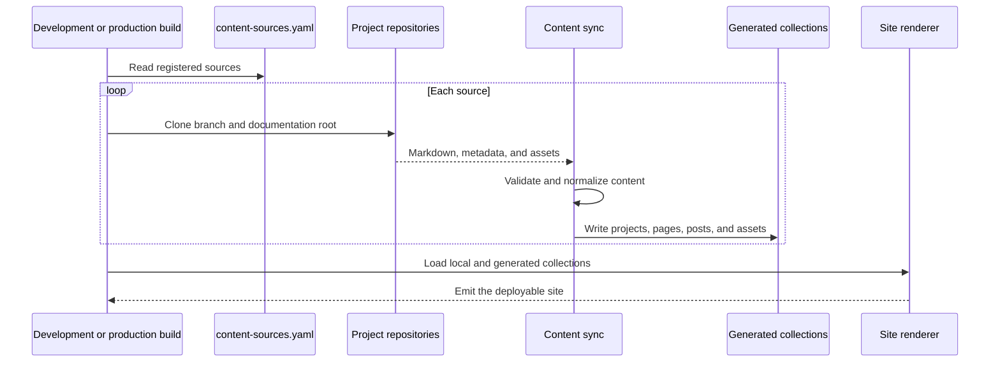

# nthings.dev

This site is built around two architectural choices:

- Project documentation stays in the repository that owns the project. The site pulls and prepares that content before every development or production build.
- Cloudflare handles the small amount of backend work that cannot be prebuilt: scheduled GitHub data refreshes, KV-backed reads, and a narrow proxy for public Confluence pages.

The rest of the site is pre-rendered content and static assets.

## Build-time content federation

[`content-sources.yaml`](content-sources.yaml) lists the repositories that contribute content. Each source owns its documentation, metadata, ordering, and assets; this repository owns how those inputs are validated, normalized, and presented.



The sync runs automatically before `npm run dev` and `npm run build`. Generated Markdown lives under `.cache/content-sources/`; copied assets live under `public/content-sources/`. Neither is an authoring location.

### Source contract

A registered repository exposes a documentation root, `docs/` by default, containing:

- `project.md`: required project landing page.
- regular Markdown files: optional project documentation pages.
- `posts/**/*.md`: optional blog posts.
- `assets/`: optional files copied into the public site.
- `nthings.meta.yaml`: optional site-specific inclusion, exclusion, slug, and page-order settings.

Register the repository in `content-sources.yaml`:

```yaml
sources:
  - owner: thiagogcm
    repo: adf4j
    slug: adf4j-docs
    order: 0
```

The source can refine its published surface without moving content into this repository:

```yaml
slug: adf4j
include:
  project: true
exclude:
  - "spec/**"
pageOrder:
  - architecture.md
  - getting-started.md
  - guide.md
  - reference.md
```

During sync, the site validates frontmatter and page order, removes source-owned page chrome such as duplicate titles and tables of contents, rewrites internal document and asset links, and converts the result into the site's content collections. A bad source fails the build rather than publishing a partial documentation tree.

## Cloudflare as the backend

Cloudflare Workers is both the request entrypoint and the runtime for the few features that need server-side behavior:

| Runtime path | Cloudflare responsibility | Result |
| --- | --- | --- |
| Normal page request | Serve the built site and run server-rendered fragments | Most content remains pre-rendered; dynamic work stays isolated. |
| Scheduled event | Query GitHub every six hours and write the aggregate to KV | Page requests read cached activity data instead of calling GitHub. |
| Cold stats cache | Start a background refresh with the request context | The response can show a fallback without waiting on GitHub. |
| `/api/confluence-adf.json` | Validate a public Confluence Cloud URL and fetch its ADF body | The browser receives a narrow JSON response, then performs the Markdown conversion locally. |

The Worker delegates regular requests to the site runtime. Its scheduled handler refreshes GitHub statistics. The status island reads those statistics from the `GITHUB_STATS` KV namespace, while the Confluence route accepts only HTTPS `*.atlassian.net` wiki page URLs containing a numeric page ID.

This boundary is intentional: content assembly belongs to the build, presentation belongs in generated pages, and network or scheduled work belongs at the edge.

## Working locally

| Command | Purpose |
| --- | --- |
| `npm run dev` | Sync external content, then start the development server. |
| `npm run sync:content` | Rebuild generated content from registered sources. |
| `npm run validate:sources` | Validate sources without writing generated output. |
| `npm run test:content-sync` | Test content normalization and link rewriting. |
| `npm run check` | Type-check the site and Worker integration. |
| `npm run build` | Sync content and produce the deployment build. |

## Deployment

[`wrangler.jsonc`](wrangler.jsonc) defines the Worker, static asset binding, custom domains, six-hour cron trigger, observability, and `GITHUB_STATS` KV binding. `GITHUB_TOKEN` is an optional Worker secret used to raise GitHub API limits and access the contribution data required by the activity panel.
