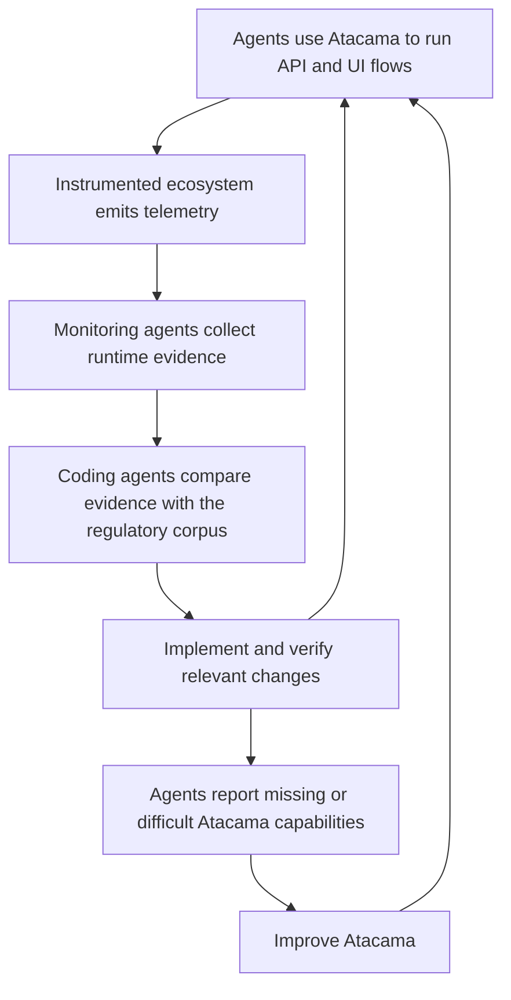

## The Authorization Server Was Only the Beginning

Last week, I presented to Sensedia's engineering team what I learned building an Authorization Server for Chile's Open Finance ecosystem with AI coding agents.

The main insight was simple:

> Code is cheap. Verification is not.

The challenge looked narrow: build an OAuth 2.0 Authorization Server and consent engine for Chile's Sistema de Finanzas Abiertas. But the Authorization Server is only one piece of the ecosystem. It must work with customers, data consumers, data holders, protected APIs, and the official participant directory.

It cannot be validated in isolation. Regulated consent must remain correct through authorization, token issuance, API access, revocation, expiration, and audit.

This was a greenfield project, and the regulator's specifications were authoritative. I did not need to preserve legacy assumptions. When runtime evidence or the regulatory corpus showed that the implementation was wrong, the code changed.

## Building an Ecosystem the Agents Could Test

Reading the Authorization Server source was not enough. A locally correct implementation could still fail when a participant registered, a customer completed a consent journey, a token reached a resource server, or a grant was revoked.

So I built a simulated Open Finance ecosystem around the Authorization Server, with running components representing the other participants. These components exercised participant registration, consent journeys, protected resource access, and trust relationships. They were not static mocks with canned responses.

Every component was fully instrumented and emitted telemetry, making behavior observable across service boundaries.

The biggest leverage was Atacama, a command-line tool that runs ecosystem flows through protocols and APIs, or through Playwright for browser interactions.

I gave Atacama to the agents as an adversarial testing interface for the ecosystem. They could execute valid and invalid flows, vary inputs, probe boundaries, interrupt journeys, and look for behavior that contradicted the specifications. Every experiment produced evidence they could inspect.

## Closing the Loop with Atacama and Telemetry

The workflow connected Atacama agents, monitoring agents, and coding agents with direct access to the regulatory corpus.

Atacama agents first exercised real protocol and browser journeys. Monitoring agents then inspected traces, state transitions, request payloads, responses, and token contents. Their job was to report what the system had actually done.

Coding agents compared that evidence with the authoritative specifications. They located the mismatch, changed the implementation, and ran the flow again. Success required evidence from the complete flow, not confidence based on reading the diff.

The feedback loop also improved Atacama. At the end of each cycle, I asked its agent users what was difficult, which operations were missing, what evidence they could not retrieve, and what prevented them from completing a task. I implemented the relevant feedback and started the cycle again.

Each cycle improved both the product and the agents' ability to test the next version. The leverage came from expanding what agents could independently execute, observe, compare, and verify.

## Build the Verification Loop First

If correctness spans multiple components, start with one critical user flow and make it executable from a single tool. Include protocol and user interface paths when both matter. Instrument every component. Give agents access to the requirements and to telemetry from their own runs. Require them to compare the two before changing code or claiming success.

Then ask what the tool prevented them from testing or understanding. Implement the useful feedback and repeat.

You do not need my stack or Atacama. You need an executable interface to your system, observable runtime evidence, and an authoritative source of truth. With those three things, agents can do more than generate code. They can challenge the system and help prove that it works.
