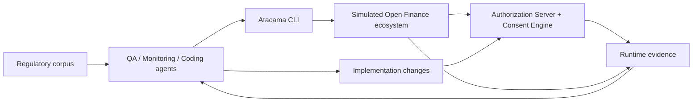

Last week I presented to Sensedia's engineering team what I learned building a FAPI 2.0 Authorization Server with embedded consent engine for Chile's emerging Open Finance. I built it using AI coding agents. As expected, code generation wasn't the bottleneck.

> Code is cheap. Verification is not.

The real challenge was proving that the generated code actually behaved correctly inside a complex, regulated ecosystem. Correctness is not a property of one service. It is a property of the flow. It spans participant registration, consent journeys, authorization details, token issuance, protected API access, revocation, expiration, and audit.

A locally correct Authorization Server can still be wrong once it interacts with data consumers, data holders, customers, protected resources, and the official participant directory.

So the real challenge became: how do you give coding agents enough access to the ecosystem that they can execute behavior, observe evidence, compare it with the regulatory corpus, and only then change the code?

## Building an Executable Ecosystem

Reading the Authorization Server source was not enough. A real ecosystem has multiple actors, trust relationships, protocol boundaries, and state transitions. So I built a simulated Open Finance ecosystem around the Authorization Server.

The important detail: these simulated participants were not generic mocks. They were purpose-built for the Authorization Server harness. The ecosystem included running components representing the surrounding participants and dependencies: data consumers, data holders, protected resources, customer-facing journeys, and directory and trust relationships. Their job was not to return canned responses. Their job was to make the Authorization Server prove its behavior in realistic flows.

That changed the role of the test environment. It was not just a place where tests ran. It became an executable model of the ecosystem around the AS.

The biggest leverage came from Atacama, an internal CLI I built as the executable interface to that ecosystem. Through Atacama, agents could run complete flows via protocols and APIs, or through Playwright when the browser journey mattered. They could register participants, start consent journeys, interrupt them before authorization, retry with modified authorization details, request tokens, call protected resources, revoke grants, vary inputs, and inspect the resulting grant state.

The simulated participants were designed to be controllable, observable, and adversarial enough for agents to use. They supported valid flows, invalid flows, boundary cases, interrupted journeys, and cross-component checks. Every component was instrumented, so each run produced runtime evidence that agents could reason about.

The agents were not asked to "read the code and decide if it looked right." They were asked to run the ecosystem, observe what happened, compare that behavior with the authoritative specifications, and report contradictions. Without a simulated ecosystem and a tool to drive it, agents would mostly reason from source code. With both, they could run the system.

## The Verification Loop

The workflow became a verification loop. Each cycle ran as follows:

1. **Execute.** QA agents exercised real protocol and browser journeys through Atacama.
2. **Capture.** Telemetry from every component produced runtime evidence: metrics, traces, state transitions, request payloads, responses, and token contents.
3. **Compare.** Monitoring agents inspected what actually happened across the ecosystem. Coding agents compared the observed behavior with the authoritative specifications.
4. **Change.** When the evidence showed a mismatch, coding agents located the issue, changed the implementation, and ran the flow again.
5. **Improve the harness.** At the end of each cycle, I asked the agents what was difficult, which operations were missing, what evidence they could not retrieve, and what prevented them from completing the task. Some feedback became new Atacama capabilities, some became better telemetry, some became better simulated participant behavior.

Success required evidence from the complete flow, not confidence based on reading the diff.

Each cycle improved both the product and the agents' ability to test the next version. The leverage came from expanding what agents could independently execute, observe, compare, and verify.

## Build the Verification Loop First

The lesson I took from this project is simple: if correctness spans multiple components, build the verification loop before trying to scale code generation.

1. Start with one critical flow.
2. Make it executable from a single tool.
3. Include protocol and browser paths when both matter.
4. Build simulated participants that are specific to the system under test, not generic mocks.
5. Instrument every component.
6. Give agents access to the requirements and to the telemetry produced by their own runs.
7. Require evidence before accepting a fix.
8. Ask what the harness prevented them from testing or understanding. Improve the harness. Repeat.

Verification is non-negotiable. Even frontier models hallucinate, and coding agents inherit the non-determinism by design. Rather than trusting their self-reported confidence, give them an authoritative source of truth, an executable environment, and runtime evidence so they can independently challenge the system and prove it meets its requirements.
