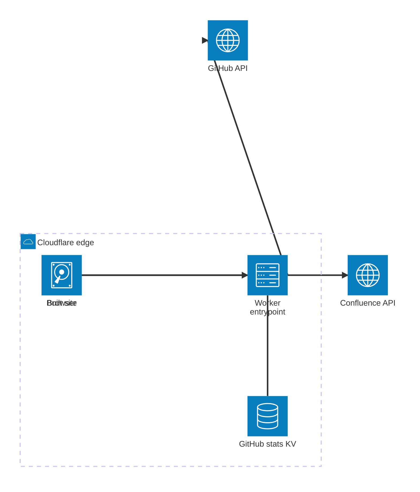

nthings.dev keeps the website separate from the projects it documents. Project repositories remain the source of truth for their own pages and posts; this site assembles them into one consistent publication during the build.

The deployed runtime is deliberately smaller than the build system. Cloudflare serves the built site and handles only work that must happen after deployment: scheduled data collection, cached reads, and controlled calls to third-party APIs.

## Content stays with the project

Each contributing repository exposes a documentation directory with a project page, optional long-form pages and posts, assets, and optional publication metadata. A central manifest tells the build which repositories to read.

Before the site renders, the content sync:

1. fetches each configured repository and documentation root;
2. validates required metadata and declared page order;
3. removes source-level chrome that the site will provide itself;
4. rewrites document and asset links for their final routes;
5. writes generated project, documentation, and blog collections; and
6. copies public assets into a source-specific path.

The build fails on an invalid source. It does not silently publish an incomplete project. Generated files are disposable build inputs, so documentation changes continue to be reviewed and released with the project they describe.

## The edge runtime

The Worker has three backend responsibilities:

- **Serve and compose responses.** Normal requests use the built site. A deferred server-rendered fragment reads cached GitHub activity without making the whole page dynamic.
- **Refresh operational data.** A six-hour cron trigger queries GitHub and stores a compact activity snapshot in KV. If the cache is cold, the request starts a background refresh and returns a fallback instead of blocking on GitHub.
- **Broker a constrained API call.** The Confluence demo sends a public page URL to an edge endpoint. The endpoint accepts only HTTPS Confluence Cloud wiki URLs, extracts the numeric page ID, and returns that page's ADF body. Conversion to Markdown then happens in the browser.

This split keeps the important boundaries explicit: repositories own content, the build turns that content into a site, and Cloudflare supplies the minimal backend capabilities the static output cannot provide.
